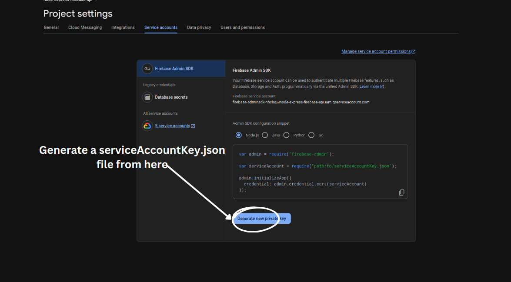

# Personal Expense management system REST API with Node and Express a full-fledged application.


## This project is for managing expenses and tracking them effeciently. 

## Features
* Secure authentication 
* Managing User profile
* Complete expense management
* Data protection

 
## APIS

Here is all the Api enpoints:
 ## 1.  User Account management


  **1.1  Create a user [Signup](routes/authUser/signup.js):**
```bash
curl -X POST http://127.0.0.1:8080/signup \
 -H "Content-Type: application/x-www-form-urlencoded" \
 -d "email=test@example.com"\
 -d  "password=1234567890"\
 -d "firstName=YourName" \
 -d "lastName=YourName"
```

It will return something like:
```bash
Status: 201 Created
...
{
  "message": "Account created successfully",
  "name": "FIRST_NAME LAST_NAME",
  "email": "test@example.com",
  "token": "eyJhbGciOiJSUzI1NiIsImtpZCI6IjcxO"
}
```

**1.2 Authenticate registered user [Log In](routes/authUser/login.js):**
```bash
curl -X POST http://127.0.0.1:8080/login \
 -H "Content-Type: application/x-www-form-urlencoded" \
 -d "email=test@example.com"\
 -d  "password=1234567890"
```
It will return something like:
```bash
Status: 200 OK
...
{
  "message": "Login successful",
  "token": "eyJhbGciOiJSUzI1NiIsImtpZCI6ImU2YWMzNT"
}
```


**1.3 Fetch User [Profile](routes/authUser/user_info.js) informations:**
```bash
curl -X GET http://127.0.0.1:8080/user_info\
     -H "Authorization: Bearer YOUR_TOKEN_HERE" 
```
It will return something like:
```bash
Status: 200 OK
...
{
  "success": true,
  "user": {
    "firstName": "FIRST_NAME",
    "lastName": "LAST_NAME",
    "email": "test@example.com"
  }
}
```


**1.4 Update User [Profile](routes/authUser/user_info.js) informations:**
```bash
curl -X PUT http://127.0.0.1:8080/user_info \
     -H "Authorization: Bearer YOUR_TOKEN_HERE" \
     -H "Content-Type: application/x-www-form-urlencoded" \
     -d "firstName=YourName" \
     -d "lastName=YourName"
```
And you will get:
```bash
Status: 200 OK
...
{
  "message": "User data updated successfully",
  "data": {
    "firstName": "FIRST_NAME_UPDATED",
    "lastName": "LAST_NAME_UPDATED"
  }
}
```


 **1.5 [Recover user password](routes/authUser/recoverPassword.js) with email:**
```bash
curl -X POST http://127.0.0.1:8080/recoverPassword \
     -H "Content-Type: application/x-www-form-urlencoded" \
     -d "email=test@example.com" 
   
```
And you will get:
```bash
Status: 200 OK
...
{
  "message": "Password reset email sent successfully"
}
```

 **1.6 [Delete user data](routes/deleteUserData.js):**

```bash
curl -X DELETE http://127.0.0.1:8080/deleteUserData \
     -H "Authorization: Bearer YOUR_TOKEN_HERE" 
     
   
```
And you will get:
```bash
Status: 200 OK
...
{
  "success": true,
  "message": "Your account and data have been deleted successfully"
}
```


## 2. Creating Category For Project. Which will populate users personal expense category.


 **2.1 [creating a new  category](routes/expenses/categoryForProject.js):**

```bash
curl -X POST http://127.0.0.1:8080/category \
     -H "Content-Type: application/x-www-form-urlencoded" \
     -H "Authorization: Bearer YOUR_TOKEN_HERE" \
     -d "categoryTitle=Miscellaneous" \
     -d "description=For unclassified expenses or one-off items that don't fit into other categories." 
   
```
And you will get:
```bash
Status: 201 Created
...
{
  "message": "Added a new category successfully",
  "data": {
    "categoryTitle": "Miscellaneous",
    "description": "For unclassified expenses or one-off items that don't fit into other categories."
  }
}
```

 **2.2 [Read all the categorys avaiable in the main project](routes/expenses/categoryForProject.js):**

```bash
curl -X GET http://127.0.0.1:8080/category \
     -H "Authorization: Bearer YOUR_TOKEN_HERE"
```
And you will get:
```bash
Status: 200 OK
...
{
  "success": true,
  "categories": [
    {
      "id": "4hQVPpbjnV6OFm1joxxK",
      "categoryTitle": "Healthcare & Insurance",
      "description": "Medical bills, pharmacy expenses, insurance premiums, and healthcare-related costs.",
      "created_at": "October 26, 2024 at 11:41:17 PM",
      "updated_at": null
    },
    {
      "id": "FXa6sgBtvlYl4eFSqS7U",
      "categoryTitle": "Entertainment & Leisure",
      "description": "Expenses for movies, streaming services, concerts, hobbies, and recreational activities.",
      "created_at": "October 26, 2024 at 11:42:37 PM",
      "updated_at": null
    }
  ]
}
```


 **2.3 [Update a category with id](routes/expenses/categoryForProject.js):**

```bash
curl -X PUT http://127.0.0.1:8080/category/:<id> \
     -H "Content-Type: application/x-www-form-urlencoded" \
     -H "Authorization: Bearer YOUR_TOKEN_HERE" \
     -d "categoryTitle=Miscellaneous updated" \
     -d "description=For unclassified expenses or one-off items that don't fit into other categories updated" 
   
```
And you will get:
```bash
Status: 200 OK
...
{
  "success": true,
  "message": "Category with ID XyciKiTUfNF6Z1mG3h5T updated successfully",
  "data": {
    "categoryTitle": "Miscellaneous updated",
    "description": "For unclassified expenses or one-off items that don't fit into other categories updated"
  }
}
```


 **2.4 [Delete a category with id](routes/expenses/categoryForProject.js):**

```bash
curl -X DELETE http://127.0.0.1:8080/category/:<id> \
     -H "Authorization: Bearer YOUR_TOKEN_HERE" 
```
And you will get:
```bash
Status: 204 OK
...
{
  "success": true,
  "message": "Category with ID XyciKiTUfNF6Z1mG3h5T deleted successfully"
}
```


## 3. User's preferences category.
 This endpoints are for user's to create their own category it will be stored only on userd account for their personal expanse management.

| Api end points  | Description                                                                             |
| ------------------------------------------------------------------------------- | --------------------------------------------------------------------------------------- |
| [base_api/usersCategory (POST)](routes/expenses/categoryForusers.js)            |  Allows creating a new  category for user personal use|
| [base_api/usersCategory (GET)](routes/expenses/categoryForusers.js)      | Allows to read all the categorys avaiable in the user account
| [base_api/usersCategory/:id (PUT)](routes/expenses/categoryForusers.js)      | Allows to update a category with id
| [base_api/usersCategory/:id (DELETE)](routes/expenses/categoryForusers.js)   | Allows to elete a category|
 


 ## 4.Expense management.

 **4.1 [Creating a new  Expense](routes/expenses/expense.js):**

```bash
curl -X POST http://127.0.0.1:8080/expense \
     -H "Content-Type: application/x-www-form-urlencoded" \
     -H "Authorization: Bearer YOUR_TOKEN_HERE" \
     -d "categoryId=8GXO2pKRhs9lJAC4c26a" \ Fetched id from users category then put it here
     -d "amount=11" \
     -d "date=29 Oct 20214" \
     -d "description=Visited Doctor there is some issue in my legs feels like it's broken" \
   
```
And you will get:
```bash
Status: 201 Created
...
{
  "message": "Added an expenses successfully",
  "data": {
    "amount": "11",
    "date": "29 Oct 20214",
    "description": "Visited Doctor there is some issue in my legs feels like it's broken"
  }
}
```


 **4.2 [Fetch all the Expenses for an user](routes/expenses/expense.js):**

```bash
curl -X GET http://127.0.0.1:8080/expense \
     -H "Authorization: Bearer YOUR_TOKEN_HERE"    
```
And you will get:
```bash
Status: 200 OK
...
{
  "success": true,
  "expenses": [
    {
      "id": "4HimB6MXM6Sfby5oPTMt",
      "categoryId": "4hQVPpbjnV6OFm1joxxK",
      "amount": "11",
      "date": "29 Oct 20214",
      "description": "Visited Doctor there is some issue in my legs feels like it's broken",
      "created_at": {
        "_seconds": 1730169130,
        "_nanoseconds": 180000000
      },
      "categoryTitle": "Healthcare & Insurance",
      "categoryDescription": "Medical bills, pharmacy expenses, insurance premiums, and healthcare-related costs."
    }
  ]
}
```


 **4.3 [Update an Expense](routes/expenses/expense.js):**

```bash
curl -X PT http://127.0.0.1:8080/expense/:<id>// id of an expense
     -H "Content-Type: application/x-www-form-urlencoded" \
     -H "Authorization: Bearer YOUR_TOKEN_HERE" \
     -d "categoryId=8GXO2pKRhs9lJAC4c26a" \
     -d "amount=20" \
     -d "date=29 Oct 2024" \
     -d "description=For unclassified expenses or one-off items that don't fit into other categories updated." 
   
```
And you will get:
```bash
Status: 200 OK
...
{
  "success": true,
  "message": "Expense updated successfully",
  "data": {
    "amount": "20",
    "date": "29 Oct 2024",
    "description": "or unclassified expenses or one-off items that don't fit into other categories updated"
  }
}
```


 **4.4 [DELETE an Expense](routes/expenses/expense.js):**
 ```bash
curl -X DELETE http://127.0.0.1:8080/expense/:<id>// id of an expense
      -H "Authorization: Bearer YOUR_TOKEN_HERE" 
```

And you will get:
```bash
Status: 200 OK
...
{
  "success": true,
  "message": "Expense deleted successfully"
}
```
## Run Locally

1. Clone the project

```bash
  git clone git@github.com:abdulawalarif/Expense-namagement-with-node-express-firebase.git
```

2. Navigate to the directory
```bash
  cd Expense-namagement-with-node-express-firebase/
```
3. Install the dependencys

```bash
   npm install
```
4. Configure firebase

 


```bash
Place the serviceAccountKey.json file into the main project
Replace the utils/firebaseAPIKey="" to your firebase Projects API key
```

  5. Start the Development Server

```bash
   npm run dev
```

  


## How to tweak this project for your own uses

This is boilerplate for  Expense management system if you want to add more fetures just extend the rest apis or if you don't want to use firebase install your preffered DB just remove firebase you are good to go.

## Found a bug?

If you found an issue or would like to submit an improvement to this project,
please submit an issue using the issues tab above. If you would like to submit a PR with a fix, reference the issue you created!

## Known issues (Work in progress)
*  Generating monthly or yearly report.


## Author

- [@abdulawalarif](https://github.com/abdulawalarif)
  
## Licence


The MIT License (MIT). Please view the [License](LICENSE) File for more information.